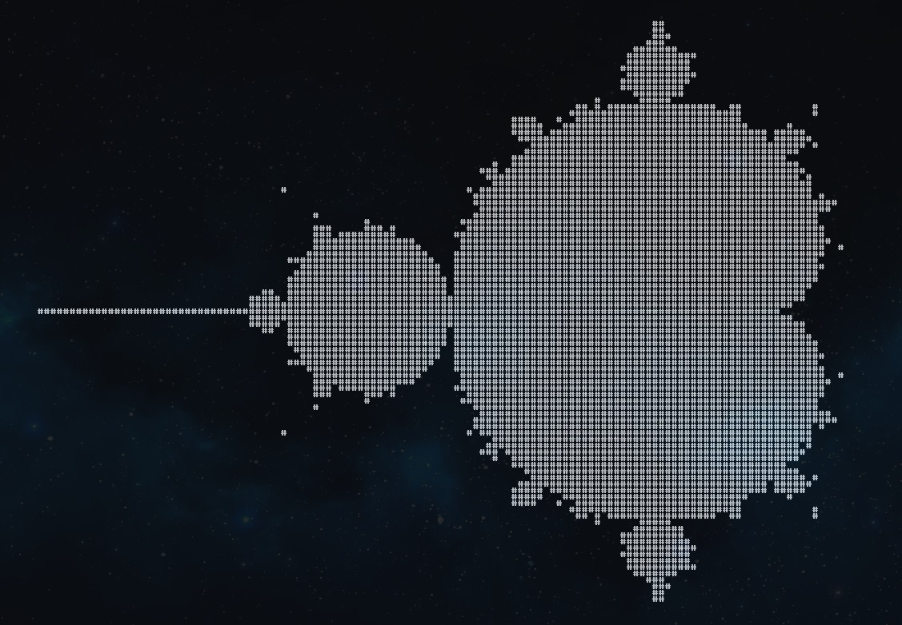
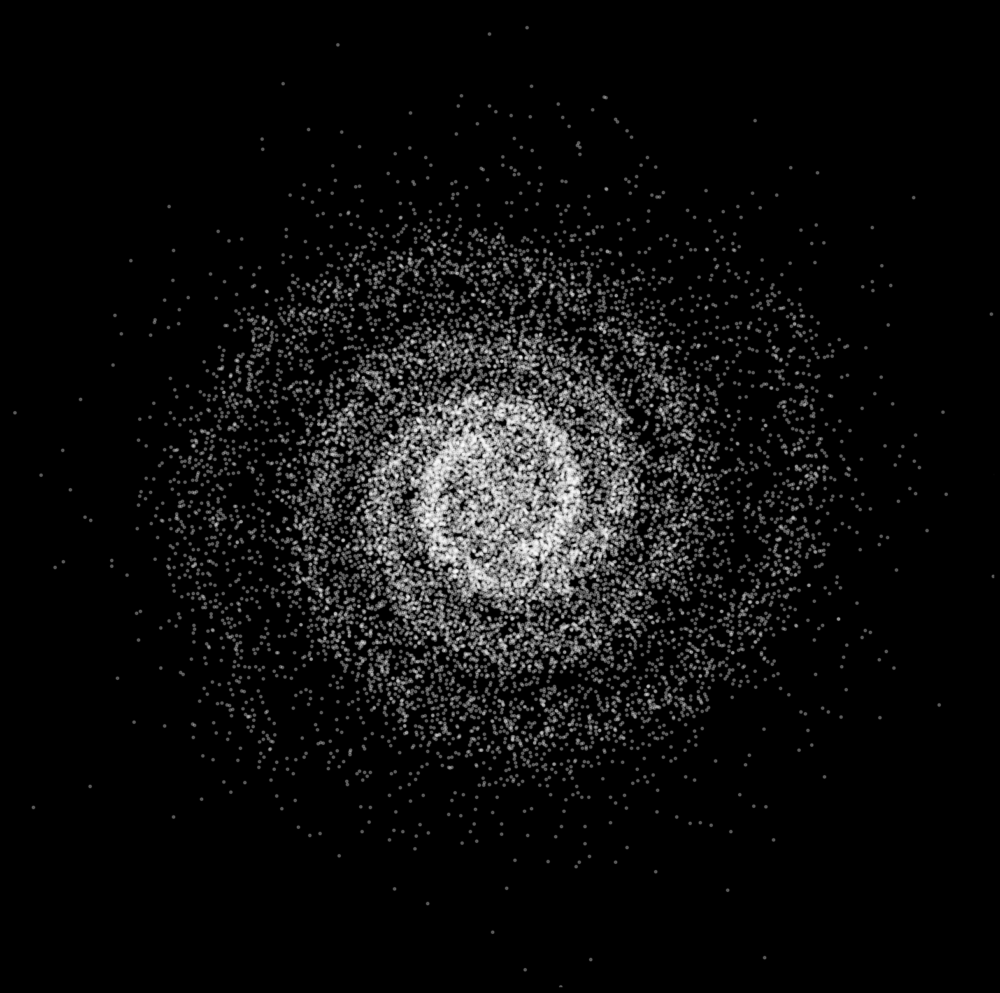
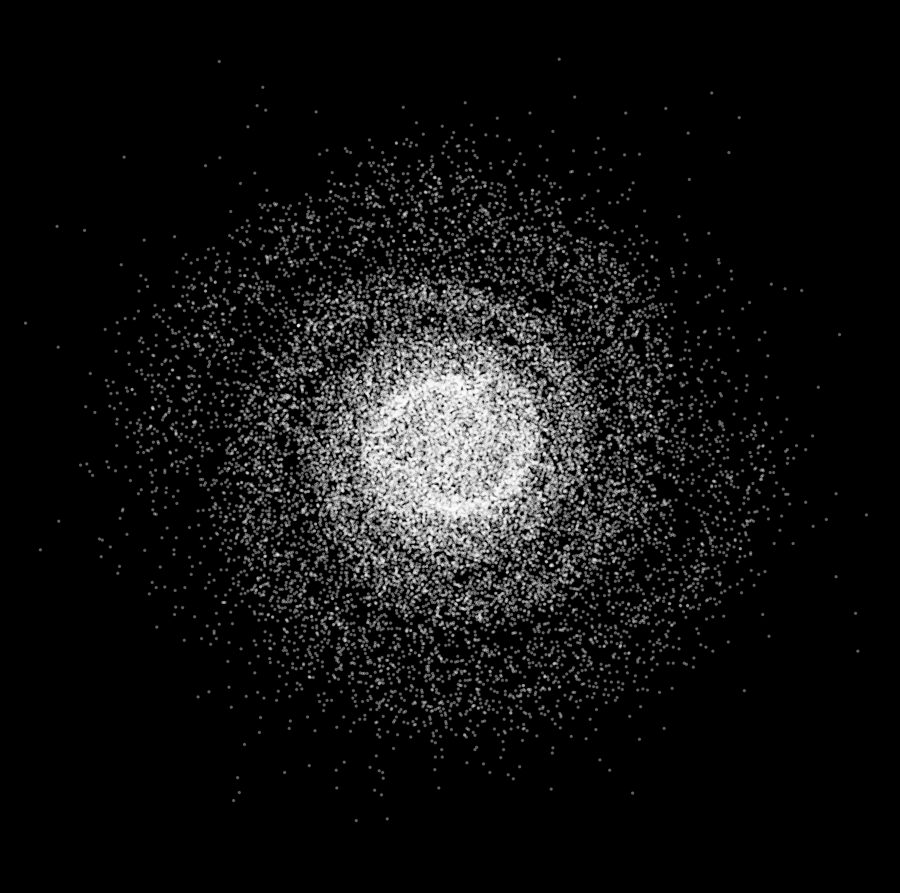
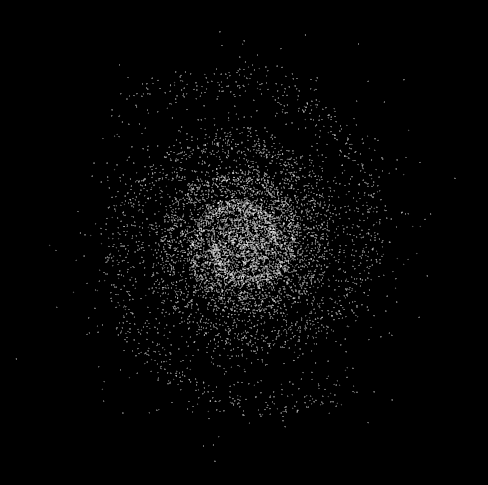
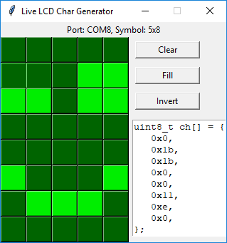
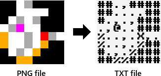

# Python stuff

There is a list of my uploaded projects and exercises (from the latest to the oldest):

- **plots** - good-looking plots and data-science-realated stuff.
- **Mandelbrot** - yet another Mandelbrot set generator in command line:

  

- **Galaxy generator** - generates an unique image of a spiral galaxy and saves it as SVG/PNG file with *matplotlib*.

  

- **geopandas** - examples/exercises notebook.
- Miscellaneous/**sunpy** - examples/exercises notebook.
- **sympy** - examples/exercises notebook.
- **matplotlib** - examples/exercises notebook.
- **pandas** - examples/exercises notebook.
- **numpy** - examples/exercises notebook.
- **Discord** - testing Discord webhooks and bots.
- **Live LCD Char Generator** - Generates custom characters for your LCD screens connected to Arduino in real time:
	
	

- **Wireframes** - renders 3D-like cuboids using lines only. Requires `pygame`. [Youtube video](https://www.youtube.com/watch?v=v5iYH_Vy54U).
- **Roguelike level generator** - converts RGB colors from png files to the matrix of characters; configurable with `config` file.
	
	

- **Higher-Lower**.
- Playing with **[urwid library](http://urwid.org/)**.
- **Fizz-Buzz**.
- **Name generator**.
