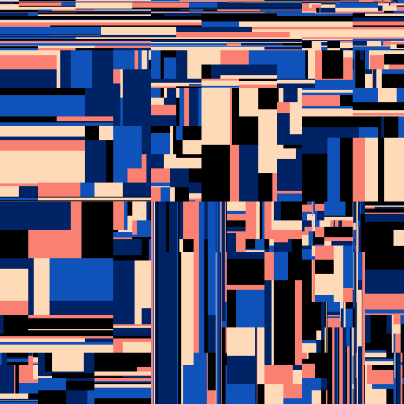
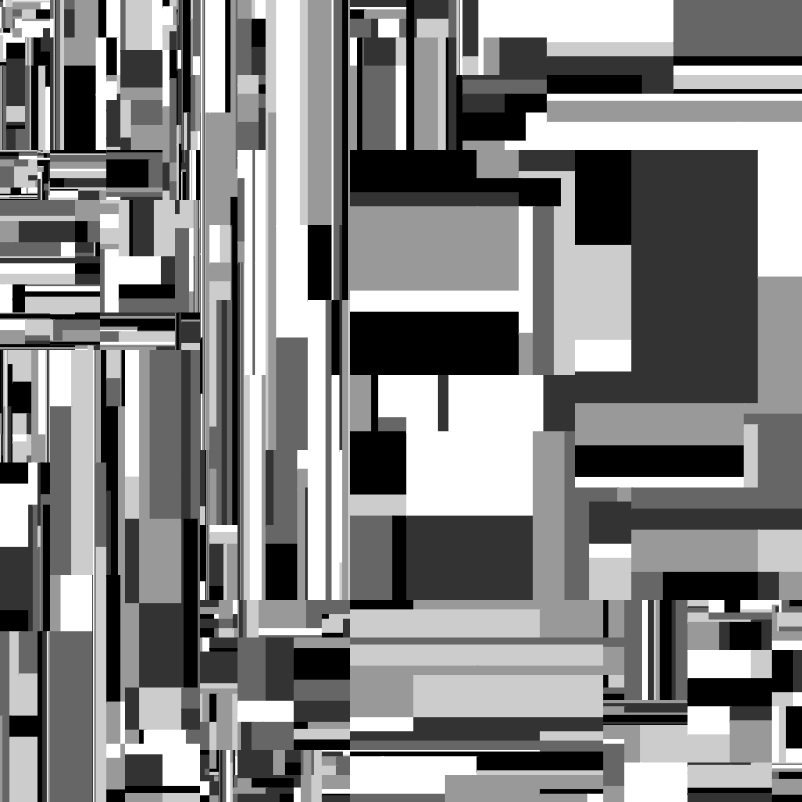
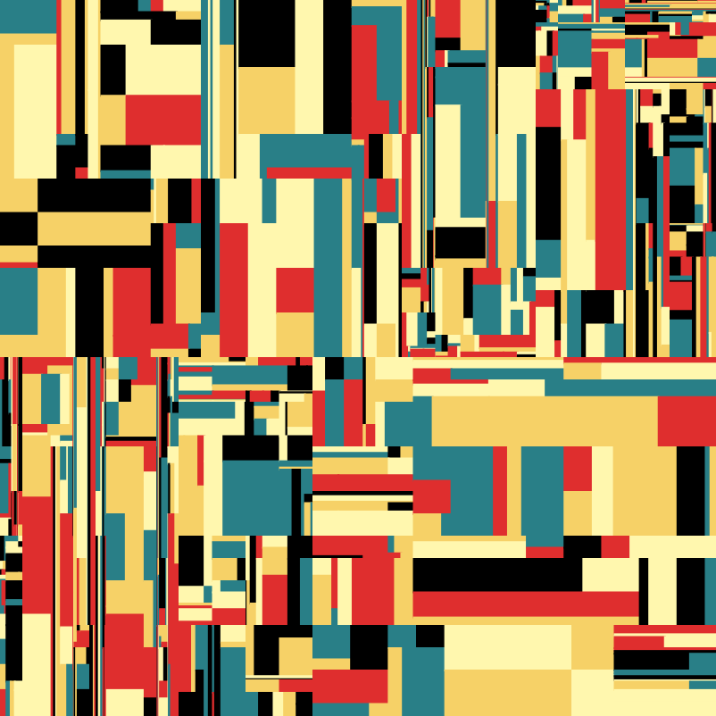
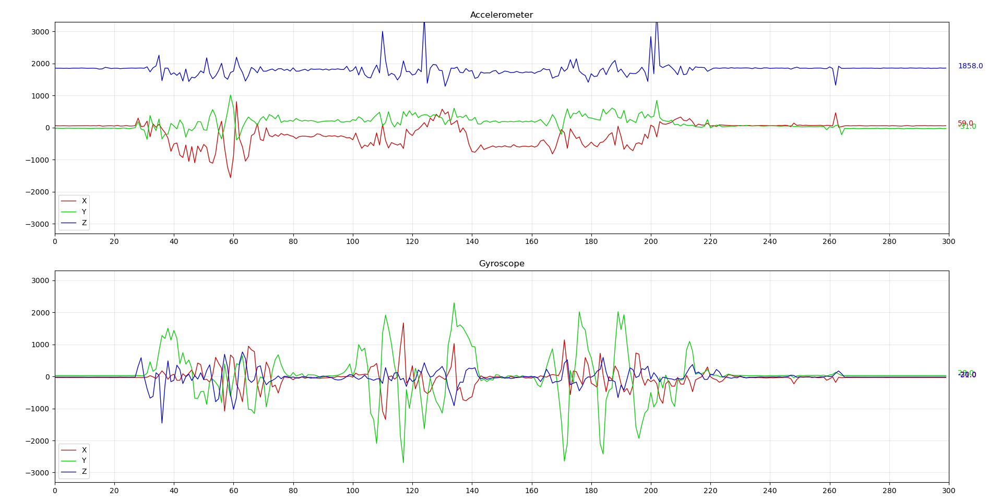

# Python stuff

There is a list of my uploaded projects and exercises (from the latest to the oldest):

- **discrete-color-fields** - a script generating pictures loosely inspired by [Jan Pamuła](https://pl.wikipedia.org/wiki/Jan_Pamu%C5%82a_(grafik))'s artworks:

  

- **chaos-game** - implementation of [the chaos game](https://en.wikipedia.org/wiki/Chaos_game). [My Youtube video](https://www.youtube.com/watch?v=4fCrPIvEHP0).

- **ahrs** - playing with attitude and heading reference systems using [ahrs library](https://pypi.org/project/AHRS/) and [MPU-6050](https://invensense.tdk.com/products/motion-tracking/6-axis/mpu-6050/) data.

  **See also:**  
  [go-stuff/serial-read-accel](https://github.com/dsonyy/go-stuff) - reading accelerometer and gyroscope data frames sent via serial port (...).  
  [go-stuff/serial-read-quaternion](https://github.com/dsonyy/go-stuff) - reading quaternion rotation data frames sent via serial port (...).  
  [cpp-stuff/angle-visualization](https://github.com/dsonyy/cpp-stuff) - visualizing quaternion rotations (...).  
  python-stuff/accelerometer-live-plot - below  
  
- **accelerometer-live-plot** - real-time visualization tool for accelerometer data with 6 degrees of freedom. [Nice YouTube video](https://www.youtube.com/watch?v=J4pH3LHojVM)

- **plots** - good-looking plots and data-science-realated stuff.

- **Mandelbrot** - yet another Mandelbrot set generator in command line:

  

- **Galaxy generator** - generates an unique image of a spiral galaxy and saves it as SVG/PNG file with _matplotlib_.

  

- **geopandas** - examples/exercises notebook.
- Miscellaneous/**sunpy** - examples/exercises notebook.
- **sympy** - examples/exercises notebook.
- **matplotlib** - examples/exercises notebook.
- **pandas** - examples/exercises notebook.
- **numpy** - examples/exercises notebook.
- **Discord** - testing Discord webhooks and bots.
- **Live LCD Char Generator** - Generates custom characters for your LCD screens connected to Arduino in real time:

- **Wireframes** - renders 3D-like cuboids using lines only. Requires `pygame`. [Youtube video](https://www.youtube.com/watch?v=v5iYH_Vy54U).
- **Roguelike level generator** - converts RGB colors from png files to the matrix of characters; configurable with `config` file.

- **Higher-Lower**.
- Playing with **[urwid library](http://urwid.org/)**.
- **Fizz-Buzz**.
- **Name generator**.
